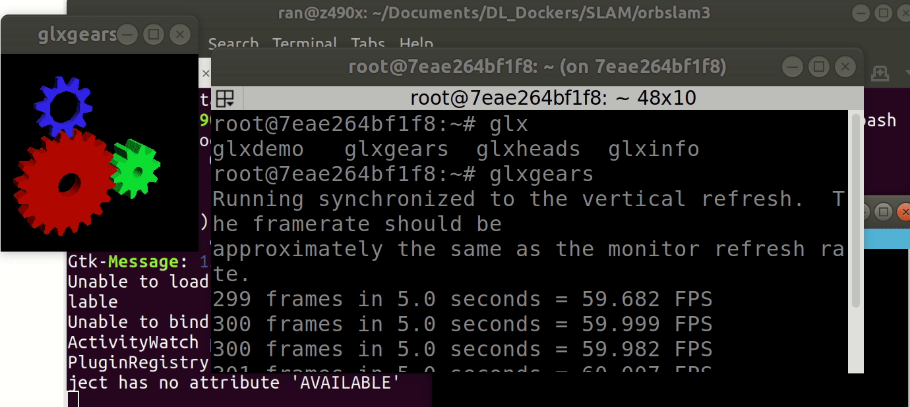
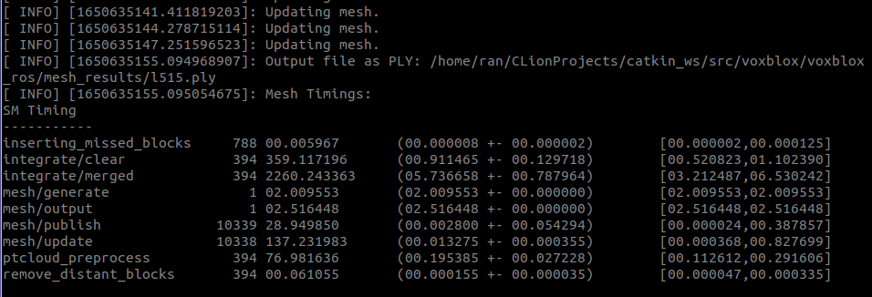

# 3D-Recon: VINS-RGBD voxblox L515


Recently we are trying to create dataset for 3D perception, so we need to create a 3D scanned environment like meta [Replica-Dataset](https://github.com/facebookresearch/Replica-Dataset). Our solution is to use the Realsense L515 sensor with `VINS` system like `VINS-RGBD` and `Kimera` to generate the pose for the sequence and use `voxblox` to generate the mesh. So much for the talk, let's head into the tutorial.

### Build VINS-RGBD & VoxBlox

Building VINS-RGBD is similar to the ones with `VINS-Mono` , make sure you have ros environment. The project was tested with:

1. Ubuntu 18.04
2. ROS version Melodic fully installation
3. Ceres Solver (1.14.0)
4. Sophus (checkout a621ff)
5. Pangolin (0.6)
6. OpenCV (3.4)

#### Build with Docker

If you are tired of configuring all kinds of environments, there is a docker env shipped with this solution:  [recon_docker](https://github.com/rancheng/Reconstruction_Pipeline/tree/master/docker). You can skip this if you want to configure your own environment locally.

```shell
cd docker/
./build-dokcer-image.bash
```

:warning: Please replace the `registry` and `proxy` server with your own address in `build-docker-image.bash` and `run-docker-image.bash`:

```shell
docker build -t registry.server.com:5000/midea/vinsrgbd \ <== replace it
    --build-arg http_proxy=http://proxyserver.com:7890 \ <== replace it
    --build-arg https_proxy=http://proxyserver.com:7890 \ <== replace it
    --build-arg USER=${user} \
    --build-arg UID=${uid} \
    --build-arg GROUP=${group} \
    --build-arg GID=${gid} \
    ${file_dir}
```

:warning: you need to make sure your display id is the current one:

```shell
$ echo $DISPLAY
:0
```

And modify this based on `docker/dockerfile`:

```shell
Ln201    RUN echo 'export DISPLAY=:0' >> /etc/profile
```

After build your docker image, run it and it will pompt out the terminator, note that it supports `OpenGL` and `X11`. So that you can run `rviz` with your remote docker.

To verify it, run the following command in your remote server:

```shell
./docker/run-docker-image.bash
```

ssh to remote server in your local computer:

```shell
ssh -p 3752 work@server.address.com
```

Then type the following command to see if the gears pompt out:

```shell
glxgears
```

If so, congratulations, you can run `rviz` remotely!



Now we can head into compiling the `VINS-RGBD` and `voxblox` ros nodes.

#### Build Locally

Initialize `ros` environment:

```shell
mkdir -p ~/catkin_ws/src
cd ~/catkin_ws
catkin init
catkin config --extend /opt/ros/melodic
catkin config --cmake-args -DCMAKE_BUILD_TYPE=Release
catkin config --merge-devel

# vins-rgbd
git clone https://github.com/rancheng/Reconstruction_Pipeline.git
cd Reconstruction_Pipeline
mv VINS-RGBD ~/catkin_ws/src/
mv voxblox ~/catkin_ws/src/

# voxblox
cd ~/catkin_ws/src/
git clone https://github.com/ethz-asl/voxblox.git
wstool init . ./voxblox/voxblox_https.rosinstall
wstool update

# build project
catkin_make
```

### Run VINS-RGBD

To run with the VINS-RGBD system, one need to use the following command:

```shell
roslaunch vins_estimator realsense_color.launch
```

Run the `Rviz` for VINS-RGBD

```shell
roslaunch vins_estimator vins_rviz.launch
```

To run the L515 use the following command:

```shell
roslaunch realsense2_camera rs_camera.launch \
device_type:=l515 enable_gyro:=true enable_accel:=true \
align_depth:=true unite_imu_method:=linear_interpolation \
color_width:=1280 color_height:=720 color_fps:=30 \
depth_fps:=30 enable_pointcloud:=true
```

To run the rosbag if you want to record the raw `imu` ,`rgb`, `depth` with `point cloud` topics:

```shell
rosbag record /camera/aligned_depth_to_color/image_raw \
/camera/color/image_raw /camera/imu /camera/depth/metadata \
/camera/color/metadata /camera/color/camera_info \
/camera/depth/color/points
```

### Run VoxBlox

To run the voxblox, use the following command:

```shell
roslaunch voxblox_ros rgbd_dataset_l515.launch
```

The launch file is configured as following:

```xml
<?xml version="1.0" encoding="ISO-8859-15"?>
<launch>
  <arg name="robot_name" default="l515" />
  <arg name="voxel_size" default="0.05" />
  <arg name="voxels_per_side" default="16" />
  <arg name="world_frame" default="world" />
  <node name="voxblox_node" pkg="voxblox_ros" type="tsdf_server" output="screen" args="--alsologtostderr" clear_params="true">
    <remap from="pointcloud" to="/camera/depth/color/points"/>
    <remap from="voxblox_node/esdf_map_out" to="esdf_map" />
    <param name="tsdf_voxel_size" value="$(arg voxel_size)" />
    <param name="tsdf_voxels_per_side" value="$(arg voxels_per_side)" />
    <param name="color_mode" value="color" />
    <param name="voxel_carving_enabled" value="true" />
    <param name="publish_esdf_map" value="true" />
    <param name="update_mesh_every_n_sec" value="1.0" />
    <param name="min_time_between_msgs_sec" value="0.0" />
    <param name="publish_pointclouds" value="true" />
    <param name="use_tf_transforms" value="false" />
    <param name="update_mesh_every_n_sec" value="0.5" />
    <param name="allow_clear" value="true" />
    <remap from="transform" to="/vins_estimator/camera_transform" />
    <param name="clear_sphere_for_planning" value="true" />
    <param name="world_frame" value="$(arg world_frame)" />
    <rosparam file="$(find voxblox_ros)/cfg/l515.yaml"/>
    <param name="mesh_filename" value="$(find voxblox_ros)/mesh_results/l515.ply" />
  </node>
</launch>
```

If you have another sensor, please make sure you can export the point cloud data to your own topic name and remap it to `voxblox` in above launch file:

```shell
 <remap from="pointcloud" to="/camera/depth/color/points"/>
```

also, please change the transform to your own topic:

```shell
<remap from="transform" to="/vins_estimator/camera_transform" />
```

Note that the `transform` message should be the following format:

```shell
geometry_msgs::TransformStamped
```

Since VINS-RGBD output pose is camera pose so that we do not need to configure the transformation matrix in `cfg`:

```shell
# actually T_R_C (C = cam0, R = rgbd cam)
T_B_C:
- [1.0, 0.0, 0.0, 0.0]
- [0.0, 1.0, 0.0, 0.0]
- [0.0, 0.0, 1.0, 0.0]
- [0.0, 0.0, 0.0, 1.0]
invert_T_B_C: false

# actually T_V_C (C = cam0, V = vicon)
T_B_D:
- [1.0, 0.0, 0.0, 0.0]
- [0.0, 1.0, 0.0, 0.0]
- [0.0, 0.0, 1.0, 0.0]
- [0.0, 0.0, 0.0, 1.0]
invert_T_B_D: false
```

To visualize the `voxblox` result, please open the `rviz config` from here:

```shell
voxblox/voxblox_ros/cfg/voxblox_vis.rviz
```

and make sure your frame id is `world`.

To export the built mesh file, please run the following command in another terminal:

```shell
rosservice /voxblox_node/generate_mesh
```



The output mesh will be exported to here:  `voxblox_ros/mesh_results/l515.ply`

Here's the visualization of 3D reconstruction of my room with `MeshLab`:


If you can not get your mesh updated in the `rviz` or the mesh topic is always empty, please make sure you have two major components ready:

- your point cloud message

- your pose message

Among them, the point cloud message should be type:

```shell
sensor_msgs/PointCloud2
```

the pose message should be type:

```shell
geometry_msgs/TransformStamped
```

If your localization sensor is different from your LIDAR sensor, please transform it use the `voxblox_ros/cfg/xxx.yaml` file to transform it to the sensor which produce the point cloud.


You can implement your own publisher to convert the camera pose to the desired message type:

```cpp
void pubCameraTransform(const Estimator &estimator, const std_msgs::Header &header)
{
    int idx2 = WINDOW_SIZE - 1;

    if (estimator.solver_flag == Estimator::SolverFlag::NON_LINEAR)
    {
        int i = idx2;
        Vector3d P = estimator.Ps[i] + estimator.Rs[i] * estimator.tic[0];
        Quaterniond R = Quaterniond(estimator.Rs[i] * estimator.ric[0]);
        geometry_msgs::TransformStamped tf_msg;
        tf_msg.header = header;
        tf_msg.header.frame_id = "world";
        tf_msg.transform.translation.x = P.x();
        tf_msg.transform.translation.y = P.y();
        tf_msg.transform.translation.z = P.z();
        tf_msg.transform.rotation.x = R.x();
        tf_msg.transform.rotation.y = R.y();
        tf_msg.transform.rotation.z = R.z();
        tf_msg.transform.rotation.w = R.w();

        //"camera_pose"
        pub_camera_transform.publish(tf_msg);
    }
}
```

This is an example of modifying `VINS-RGBD` publisher. 


Make sure your message `xxx_msg.header.frame_id`  is set to `world`.


In order to obtain a better reconstructed mesh. the best practice is to save the point cloud and pose stamps into a new bagfile and set the reconstruction resolution to 0.001m and play the bag 10x slower.


To be continued with boundfusion cuda backend with realtime high-res reconstruction pipeline.
